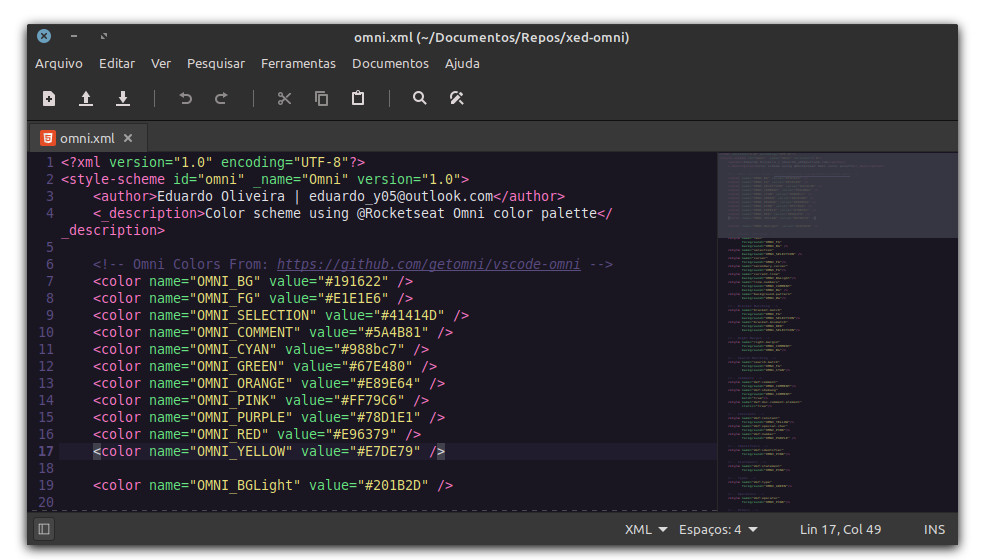
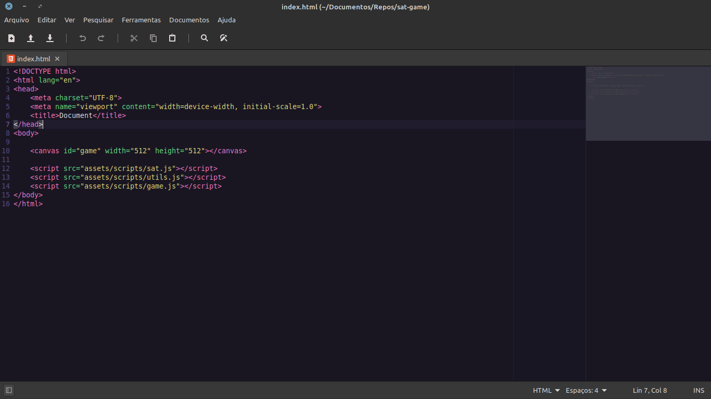
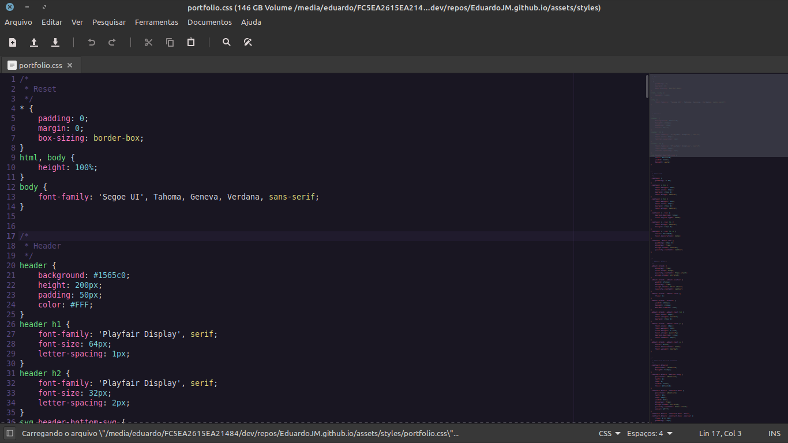
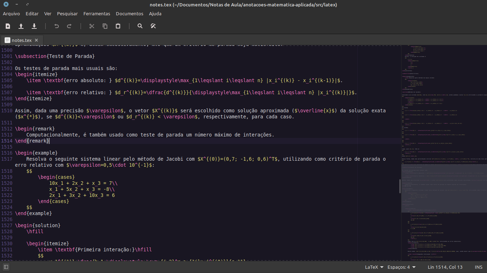
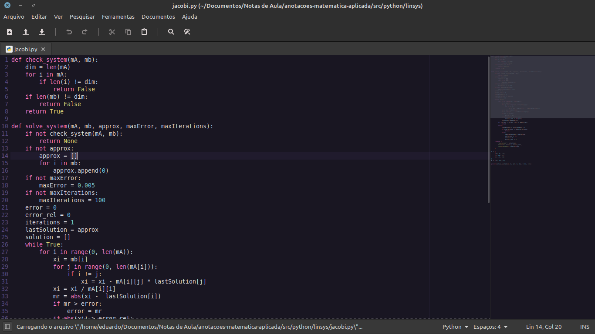
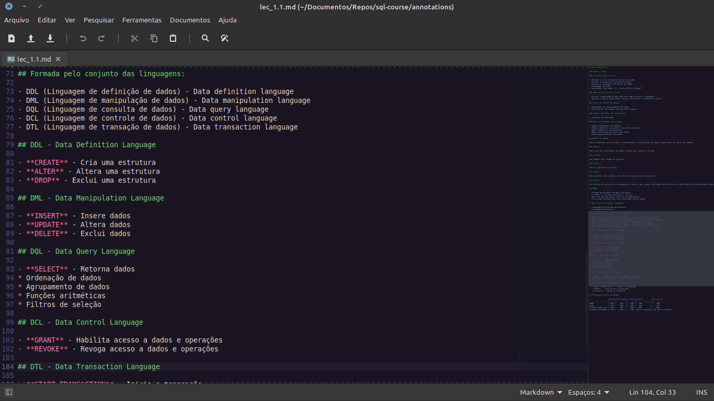
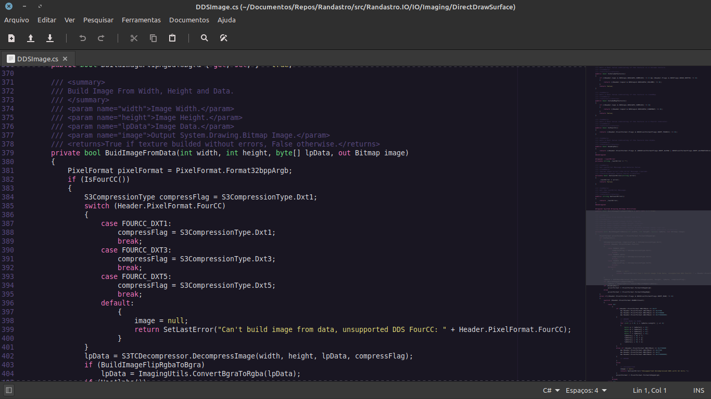

# Xed Omni Theme

[Xed](https://github.com/linuxmint/xed) is a small and lightweight text editor default installed in Linux Mint. This theme is based on the [@Rocketseat](https://github.com/rocketseat) [Omni](https://github.com/getomni/vscode-omni) theme.

    

## Observation

This theme is created for the Xed Linux Mint software but the `omni.xml` possibly will work in any `gtksourceview` component.

## Instalation

1 - Download the `omni.xml` file to your computer.

2 - Open the Xed software and go to **Edit -> Preferences** and, then, go to the **Theme**. Click in the **+** button to add an new theme and open the `omni.xml`. Select the `Omni` theme in the list and, now, your Xed is using this style.

## Some file types viewed in Xed with Omni Theme

### HTML

    

### CSS

    

### (La)TeX

    

### JavaScript

    

### Python

    

### Markdown

    

### CSharp

    

